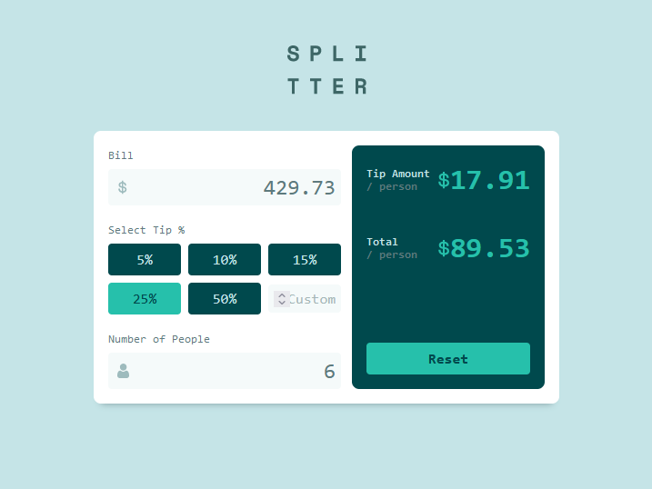

# Frontend Mentor - Tip calculator app solution

Welcome I am [Samir Ahmad](samirahmad5445@gmail.com) and this is a solution to the [Tip calculator app challenge on Frontend Mentor](https://www.frontendmentor.io/challenges/tip-calculator-app-ugJNGbJUX). Frontend Mentor challenges help you improve your coding skills by building realistic projects.

## Table of contents

- [Overview](#overview)
  - [The challenge](#the-challenge)
  - [Screenshot](#screenshot)
  - [Links](#links)
- [My process](#my-process)
  - [Built with](#build-with)
  - [What I learned](#what-i-learned)
  - [Continued development](#continued-development)
- [Find Me On](#find-me-on)
  - [Gmaill](mailto:samirahmad5445@gmail.com)
  - [GitHub](https://github.com/SamirAhmad5445)
  - [Frontend Mentor](https://www.frontendmentor.io/profile/SamirAhmad5445)

## Overview

### The challenge

Users should be able to:

- View the optimal layout for the app depending on their device's screen size
- See hover states for all interactive elements on the page
- Calculate the correct tip and total cost of the bill per person

### Screenshot



### Links

- Solution URL: [Add solution URL here]()
- Live Site URL: [Add live site URL here]()

## My process
### build with

- Semantic HTML5 markup
- CSS custom properties
- CSS pseudo selectors
- [CUBECSS](https://cube.fyi/) - CSS naming convention 
- Flexbox
- CSS Grid
- [SASS](https://sass-lang.com/) - CSS preprosser

### What I learned
this project was an training for me on sass,i had learned how to use @use and @forword to import my sass parcial instead of the debrecated @import, and also it's my fisrt time using the input event in JavaScript.

Here some of sass codes snippets:

- function to convert number from px to em or rem (comes in handy with media quiries)
```scss
@function convert($value, $unit: em) {
  @if meta.type-of($value) == number {
    @return if(
      math.is-unitless($value),
      calc($value / 16) + $unit,
      string.slice(#{calc($value / 16)}, 1, -3) + $unit
    );
  } @else {
    @error "this function works with numbers by px unit";
  }
}
```
- mixin to determine max column count in css grid 
```scss
@mixin max-column($count, $gap: size(2)) {
  display: grid;
  place-items: center;
  grid-auto-flow: column;
  gap: $gap;
  @for $i from 1 through $count {
    > :nth-child(#{$count}n + #{$i}) {
      grid-column: $i;
    }
  }
}
```
also some javascript snippets
- function to activate the button which  is been clicked
```js
buttons.forEach(button=> {
  button.addEventListener('click', ()=> {
    // deactivate the rest of the button
    buttonsDeactivate();
    button.classList.add('active');
    customTipInput.classList.remove('active');
    // to determine the tip from the button
    buttonTipActive = true; // we using tip from a button
    customTipActive = false;
    splitter();
  });
});
```
- function for deactivating the buttons
```js
const buttonsDeactivate = function() {
  buttons.forEach(button=> {
    button.classList.remove('active');
  });
};
```
### Continued development

I would learn more about SASS and the CSS Preprossers and also I would like to get into the world of JavaScript Frameworks and inprove my frontend skills with Good Fundamentals, Practical Applications, and by learning more technologies like PostCSS and gulp to increase the efficience of my code. 

## find me on
- GitHub - [@SamirAhmad5445](https://github.com/SamirAhmad5445)
- Gmaill - [samirahmad5445@gmail.com](samirahmad5445@gmail.com)
- Frontend Mentor - [@SamirAhmad5445](https://www.frontendmentor.io/profile/SamirAhmad5445)


